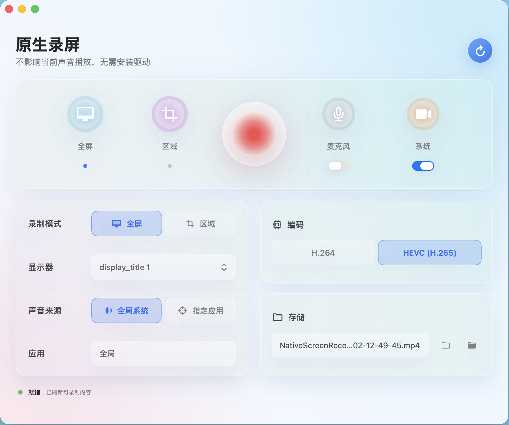
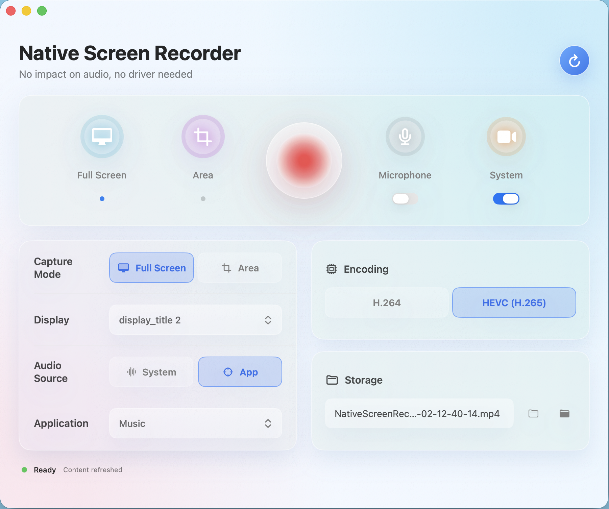

# Mac 原生录屏软件

**中文** | [English](./README_EN.md)

一款纯粹的 macOS 原生录屏工具。无需安装任何第三方虚拟声卡（如 BlackHole），不改变系统音频路由，直接利用 ScreenCaptureKit 和 Core Audio 底层 API 实现屏幕、系统声音、麦克风的独立录制。

## 软件截图

### 中文版



### 英文版



---

## 核心功能

### 1. 全屏录制

一键录制整个显示器画面。自动获取 Retina 物理分辨率，确保视频清晰度与屏幕一致，不降采样。

### 2. 自定义区域录制

拖拽鼠标框选任意录制区域。选区过程有半透明蒙层、白色边框和实时尺寸标注，支持 ESC 取消。录制时区域外显示虚线边框指示器，且边框不会被录进视频。

### 3. 指定应用录制

可选择只录制某个特定应用的窗口画面。应用列表会实时刷新，显示当前运行的、有窗口的应用供选择。

### 4. 系统声音录制

**这是本软件的核心亮点**。无需安装 BlackHole 等虚拟声卡，直接捕获系统正在播放的所有声音（浏览器、音乐播放器、视频会议等），不改变系统默认音频输出设备，也不会影响你正在使用的扬声器或耳机。

支持两种系统音频采集模式：

- **全局系统声音** — 录制所有应用发出的声音
- **指定应用声音** — 只录制你选中的应用发出的声音（基于 Core Audio Process Tap 技术，macOS 14.2+）

对于 Chrome、Edge、Safari 等浏览器，软件能自动发现其多进程架构下的音频子进程，确保完整捕获浏览器播放的声音。

### 5. 麦克风录制

独立的麦克风音轨开关。可单独录制系统声音，也可同时录制麦克风，两路音频分开存储为独立音轨，互不干扰。

### 6. 三轨独立架构

屏幕画面、系统音频、麦克风各自独立编码为 MP4 的三个轨道：

- 视频轨：H.264 或 HEVC（H.265）编码
- 系统音频轨：AAC 192kbps
- 麦克风音频轨：AAC 128kbps

不做任何混音处理，保证每路音频的原始质量，彻底解决传统混音方案导致的失真、闷音问题。

### 7. 色彩保真

macOS 屏幕原生使用 Display P3 广色域，但视频标准使用 Rec.709。本软件在编码过程中自动进行色彩空间转换（VTPixelTransferSession），配合 full range 元数据输出，确保录制画面颜色鲜艳、不泛白。

### 8. 双编码器支持

- **H.264** — 兼容性最好，所有播放器通用
- **HEVC (H.265)** — 同画质下文件体积更小

码率根据录制分辨率自动分档，平衡清晰度和文件大小。

### 9. 中英文双语界面

编译时通过 `-DENGLISH` 标志切换语言，提供完整的中文和英文两种界面。

---

## 系统要求

- **操作系统**：macOS 15.0 (Sequoia) 或更高版本
- **架构**：Apple Silicon (M1/M2/M3/M4/M5) 或 Intel Mac
- **权限**：需要授予屏幕录制权限和麦克风权限（系统设置 → 隐私与安全性）

---

## 下载

| 版本 | 下载 |
|------|------|
| v2.6.2 (自动跟随系统语言) | [NativeScreenRecorder_v2.6.2.zip](Releases/NativeScreenRecorder_v2.6.2.zip) |

下载后解压，将 `.app` 拖入「应用程序」文件夹即可。软件会自动跟随系统语言显示中文或英文界面。

首次打开时，在程序图标上右键 →「打开」以绕过未签名应用的 Gatekeeper 提示。之后即可正常使用。

---

## 技术实现

### 技术栈

- **语言**：Swift 6.0
- **UI 框架**：SwiftUI
- **屏幕采集**：ScreenCaptureKit (SCStream)
- **音频采集**：ScreenCaptureKit 音频流 + Core Audio Process Tap
- **视频编码**：AVAssetWriter + VideoToolbox
- **构建工具**：Swift Package Manager

### 架构

```
SCStream ── .screen ──→ CMSampleBuffer ──→ MovieFileWriter (video track)
         ── .audio ──→ CMSampleBuffer ──→ MovieFileWriter (systemAudio track)
         ── .mic   ──→ CMSampleBuffer ──→ MovieFileWriter (microphone track)
```

三路数据流完全独立，AVAssetWriter 自动处理音视频同步。

### 为什么不用 BlackHole？

传统的 macOS 系统声音录制方案需要安装 BlackHole 等虚拟音频驱动，将系统音频路由到虚拟设备再采集。这会：

- 改变系统音频输出路径，影响日常使用体验
- 需要额外的驱动安装和维护
- 在多声道设备上容易出现格式不匹配问题

本软件使用 ScreenCaptureKit 的 `.audio` 流输出能力，直接从系统音频总线中获取数据，零侵入、零配置。

---

## 构建

```bash
# 克隆仓库
git clone https://github.com/iamjunjun/Mac-Native-Screen-Recorder.git
cd Mac-Native-Screen-Recorder/NativeScreenRecorder

# 中文版构建
swift build -c release

# 英文版构建
swift build -c release -Xswiftc -DENGLISH

# 一键打包中英双版本
./Scripts/package_app.sh
```

---

## 版本历史

| 版本 | 更新内容 |
|------|----------|
| v2.0 | 实现系统音频录制（ProcessTapAudioCapture） |
| v2.1 | 区域录制、HEVC 编码、浏览器音频发现、崩溃修复 |
| v2.2 | 麦克风混音录制 |
| v2.3 | UI 重新设计，Modern 风格 |
| v2.4 | Hero 控制栏、玻璃面板 UI 优化 |
| v2.5 | 修复混音采样率对齐 + 麦克风独立录制崩溃 |
| v2.6.0 | **三轨分离架构** — 彻底解决混合录制失真问题 |
| v2.6.1 | 色彩管线修复 + 指定应用声音恢复 + 英文界面 + UI 微调 |
| v2.6.2 | 菜单栏功能 + 麦克风硬件检测 + 系统语言自动跟随 + UI 优化 |

---

## 许可证

MIT License
