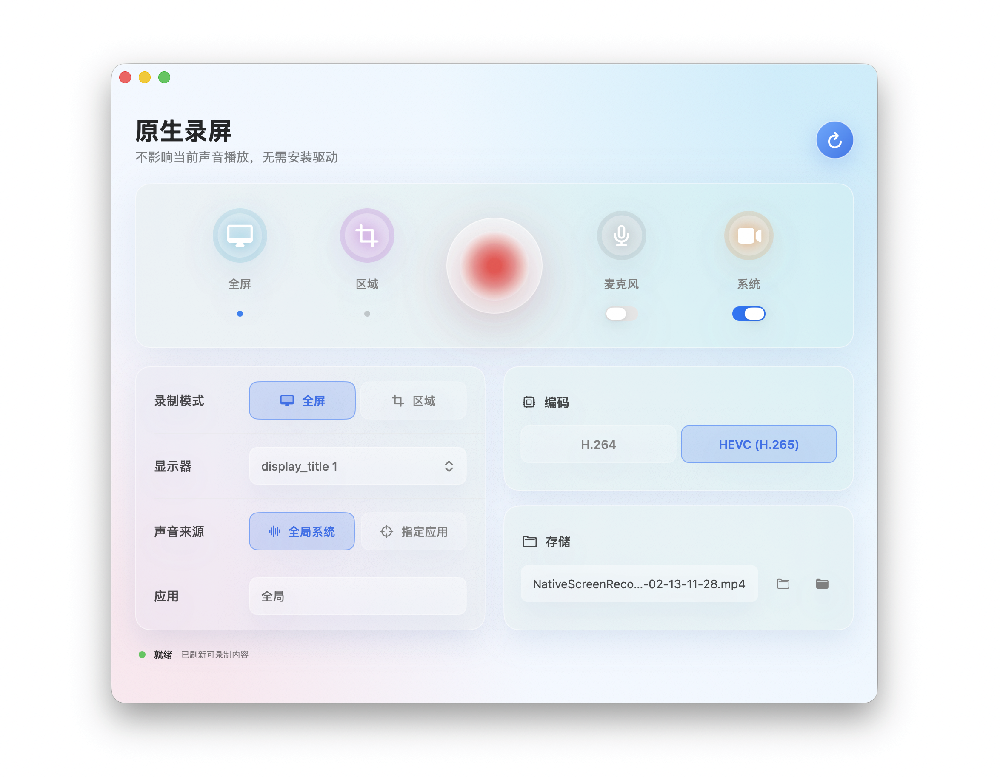
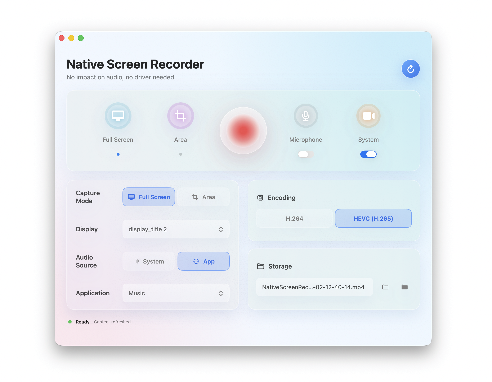

# Mac Native Screen Recorder

[中文](./README.md) | **English**

A pure macOS-native screen recording tool. No virtual audio drivers (BlackHole) required, no system audio routing changes. Captures screen, system audio, and microphone independently via ScreenCaptureKit and Core Audio APIs.

---

## Screenshots

### Chinese UI



### English UI



---

## Core Features

### 1. Full-Screen Recording

One-click recording of the entire display. Automatically captures at the Retina physical pixel resolution — video sharpness matches your screen with no downsampling.

### 2. Custom Area Recording

Drag to select any region of the screen. A translucent overlay with a white border and real-time dimension label guides your selection. ESC cancels. During recording, a dashed-border indicator marks the capture area without appearing in the recorded video.

### 3. Per-Application Recording

Record video from a single application window. The app list refreshes in real time, showing all running applications with visible windows.

### 4. System Audio Capture

**The standout feature.** Capture all system audio — browsers, music players, video calls — without BlackHole or any virtual audio device. Your default audio output is untouched; speakers and headphones continue to work normally.

Two system audio modes:

- **Global** — record audio from all applications
- **Per-Application** — record audio from a specific app only (powered by Core Audio Process Tap, macOS 14.2+)

For Chromium-based browsers (Chrome, Edge) and Safari, the app automatically discovers audio sub-processes across the browser's multi-process architecture, ensuring complete audio capture.

### 5. Microphone Recording

Independent mic track toggle. Record system audio alone, or add microphone — both audio sources are stored as separate tracks with no crosstalk.

### 6. Three-Track Architecture

Screen, system audio, and microphone are each encoded as independent tracks in a single MP4:

- **Video track**: H.264 or HEVC (H.265)
- **System audio track**: AAC 192 kbps
- **Microphone track**: AAC 128 kbps

Zero audio mixing. Each source retains its original quality, eliminating the distortion and muddiness that plague traditional mixing approaches.

### 7. Color Accuracy

macOS screens use the Display P3 wide color gamut, but video standards expect Rec.709. The app performs automatic color space conversion (via VTPixelTransferSession) and outputs full-range metadata, so recorded video looks vibrant — not washed out.

### 8. Dual Codec Support

- **H.264** — maximum compatibility with all media players
- **HEVC (H.265)** — smaller file sizes at equivalent quality

Bitrate adapts automatically based on recording resolution.

### 9. Bilingual UI (Chinese / English)

Full Chinese and English interfaces, switched at compile time via the `-DENGLISH` flag. No runtime overhead — each build is a self-contained single-language binary.

---

## System Requirements

- **OS**: macOS 15.0 (Sequoia) or later
- **Architecture**: Apple Silicon (M1–M5) or Intel Mac
- **Permissions**: Screen recording + microphone access (System Settings → Privacy & Security)

---

## Download

| Version | Link |
|---------|------|
| v2.6.2 (auto language detection) | [NativeScreenRecorder_v2.6.2.zip](Releases/NativeScreenRecorder_v2.6.2.zip) |

Unzip and drag the `.app` bundle into your Applications folder. The app automatically follows your system language — Chinese or English.

On first launch, right-click the app icon → **Open** to bypass Gatekeeper for the unsigned binary. Subsequent launches work normally.

---

## Tech Stack

- **Language**: Swift 6.0
- **UI Framework**: SwiftUI
- **Screen Capture**: ScreenCaptureKit (SCStream)
- **Audio Capture**: SCStream audio + Core Audio Process Tap
- **Video Encoding**: AVAssetWriter + VideoToolbox
- **Build System**: Swift Package Manager

## Architecture

```
SCStream ── .screen ──→ CMSampleBuffer ──→ MovieFileWriter (video track)
         ── .audio ──→ CMSampleBuffer ──→ MovieFileWriter (systemAudio track)
         ── .mic   ──→ CMSampleBuffer ──→ MovieFileWriter (microphone track)
```

Three fully independent data pipelines; AVAssetWriter handles A/V synchronization automatically.

### Why Not BlackHole?

Traditional macOS system-audio recording requires installing a virtual audio driver like BlackHole and routing system output through it. This:

- Alters the system audio path, degrading the everyday listening experience
- Requires separate driver installation and maintenance
- Frequently causes format mismatches on multi-channel devices

This app uses ScreenCaptureKit's `.audio` stream output to pull audio directly from the system bus — zero setup, zero side effects.

---

## Build

```bash
# Clone
git clone https://github.com/iamjunjun/Mac-Native-Screen-Recorder.git
cd Mac-Native-Screen-Recorder/NativeScreenRecorder

# Chinese build
swift build -c release

# English build
swift build -c release -Xswiftc -DENGLISH

# Package both versions with one command
./Scripts/package_app.sh
```

---

## Changelog

| Version | Changes |
|---------|---------|
| v2.0 | System audio recording (ProcessTapAudioCapture) |
| v2.1 | Area recording, HEVC encoding, browser audio discovery, crash fixes |
| v2.2 | Microphone mixing |
| v2.3 | UI redesign — modern style |
| v2.4 | Hero control bar, glass-morphism panels |
| v2.5 | Mixing sample-rate fixes + mic-only recording crash fix |
| v2.6.0 | **Three-track architecture** — eliminated audio mixing distortion |
| v2.6.1 | Color pipeline fix + per-app audio restoration + English UI + polish |
| v2.6.2 | Menu bar integration + mic hardware detection + system language auto-follow + UI polish |

---

## License

MIT License
